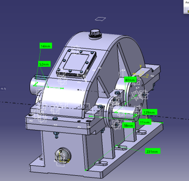
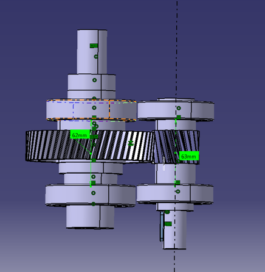
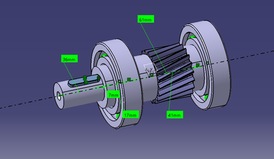
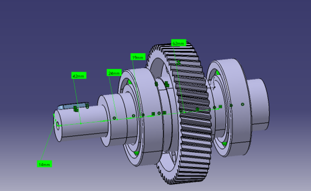
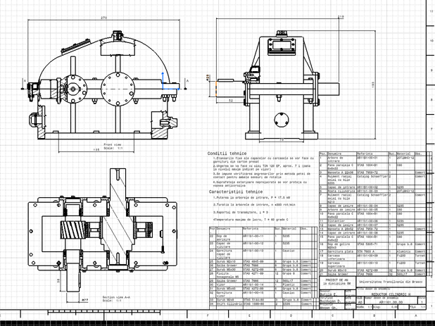
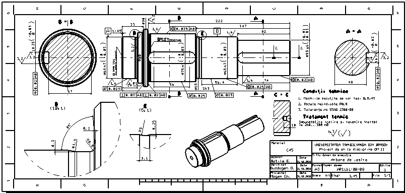

# Reductor cilindric cu o treaptă — RCil H

**Proiect de an la disciplina Organe de Mașini**
Universitatea Transilvania din Brașov · Facultatea de Inginerie Mecanică
Departamentul Autovehicule și Transporturi · 2026

Proiectarea completă a unui reductor de turație cu o treaptă, cu angrenaj cilindric cu dantură
înclinată și plan orizontal al axelor (varianta **RCil H**): de la tema de proiectare și calculul
analitic, prin modelarea 3D în CATIA V5 și verificarea în MDESIGN, până la desenul de ansamblu și
desenele de execuție.

| | |
|---|---|
| **Autor** | Horia-Eusebiu ȘTEFAN — Programul de studii Robotică, grupa 4LF832 |
| **Coordonatori** | Prof. univ. dr. ing. Gheorghe MOGAN · Dr. ing. Eugen BUTILĂ · Drd. ing. Diana BUZDUGAN |
| **Software** | CATIA V5 (modelare 3D, desene), MDESIGN 2020 (verificare arbori) |
| **Documentație** | [Memoriu tehnic (PDF, 47 pagini)](docs/Memoriu-Tehnic-Stefan-Horia-Eusebiu.pdf) |

> 🇬🇧 English version: [README.md](README.md)

<p align="center">
  
  <br>
  <sub><i>Ansamblul general al reductorului RCil H pe cadrul suport, modelat in CATIA V5.</i></sub>
</p>

---

## 1. Tema de proiectare

| Parametru | Simbol | Valoare |
|---|---|---|
| Puterea la intrare | `P_i` | 17,5 kW |
| Turația la intrare | `n_i` | 3000 rot/min |
| Raportul de transmitere | `i_R` | 3 |
| Durata de funcționare impusă | `L_h imp` | 12 000 ore |
| Planul axelor | `PA` | Orizontal (H) |
| Numărul de dinți ai pinionului | `z_1` | 19 |

**Condiții de funcționare:** utilaj de tip elevator auto sau stand de testare frâne; încărcare
exterioară alternativă cu șocuri; acționare cu motor electric asincron cu rotorul în scurtcircuit;
nivel de zgomot max. 25 dB; mediu −20…60 °C, umiditate max. 30 g/m³.

**Condiții constructive:** intrare și ieșire pe părți opuse, arbore de ieșire plin.

---

## 2. Parametri cinetostatici

| Arborele | Puterea | Turația | Momentul de torsiune |
|---|---|---|---|
| Intrare (A1) | `P_1` = 17,5 kW | `n_1` = 3000 rot/min | `M_t1` = 55 704 Nmm |
| Ieșire (A2) | `P_2` = 16,62 kW | `n_2` = 1000 rot/min | `M_t2` = 158 756 Nmm |

Randamentul angrenajului cilindric considerat: `η` = 0,95.
Numere de dinți: `z_1` = 19, `z_2` = 57 → raport recalculat `u` = 3, abatere față de `i_R` = **0 %**.

---

## 3. Angrenajul cilindric

<p align="center">
  
  <br>
  <sub><i>Angrenajul in functionare: pinionul <code>z<sub>1</sub></code> = 19 si roata <code>z<sub>2</sub></code> = 57,
  unghi de inclinare &beta; = 14&deg;, distanta dintre axe <code>a<sub>w</sub></code> = 80 mm.</i></sub>
</p>

### Material și tratament termic

Deoarece `M_t1` = 55 704 Nmm > 30 000…40 000 Nmm, s-a adoptat pentru ambele roți un **oțel de
cementare, 20TiMnCr12**.

| `σ_c` | `σ_r` | Tratament | Duritate flanc | Duritate miez | `σ_Hlim` | `σ_Flim` |
|---|---|---|---|---|---|---|
| 850 MPa | 1100 MPa | Cementare | 60 HRC | 340 HB | 1530 MPa | 430 MPa |

Prelucrare: frezare înainte de cementare, rectificare după călire și revenire.

### Predimensionare și geometrie

Modulul frontal calculat: `m_c` = max(`m_H`, `m_F`) = max(1,89 ; 1,82) = **1,89 mm** → solicitarea
de contact este solicitarea principală.

| Parametru | Relație | Valoare |
|---|---|---|
| Modulul normal (standardizat) | `m_n` | 2 mm |
| Modulul frontal | `m = m_n / cos β` | 1,889 mm |
| Unghiul de înclinare a danturii | `β` | 14° |
| Diametrul de divizare pinion | `d_1 = m·z_1` | 35,9 mm |
| Diametrul de divizare roată | `d_2 = m·z_2` | 107,673 mm |
| Distanța dintre axe de referință | `a` | 78,32 mm |
| **Distanța dintre axe standardizată** | `a_w` | **80 mm** |
| Lățimea danturii roții | `b_2` | 27 mm |
| Lățimea danturii pinionului | `b_1 = b_2 + 4…6` | 31 mm |

Restricția de standardizare `−0,5·m_n < a_w − a ≤ m_n` → `−1 < 1,68 ≤ 2` ✔

### Deplasări de profil (angrenaj PLUS)

Pentru a asigura distanța dintre axe impusă și rezistențe mărite la contact și încovoiere:

| `x_n1` | `x_n2` | `x_ns` | `α` (presiune frontal) | `α_w` (angrenare frontal) |
|---|---|---|---|---|
| +0,4711 | +0,4278 | 0,899 | 20,5617° | 23,561° |

Verificarea ascuțirii dinților (măsurată pe modelul CATIA):
`s_1` = 0,433 mm, `s_2` = 0,973 mm > (0,3…0,45)·`m_n`/2 ✔

### Continuitatea angrenării

Gradul de acoperire frontal, obținut prin măsurare pe modelul CATIA de simulare:
`ε_αm` = (T₁B − T₁A) / `p_b` = (12,884 − 4,589) / 6,043 = **1,372**
față de valoarea calculată `ε_α` = **1,381** → abatere **−0,65 %** ✔

### Execuție și montaj

| | |
|---|---|
| Treapta de precizie / ajustaj | 8 / B, toleranța jocului tip *b* |
| Procedeu de prelucrare final | Frezare îngrijită și mortezare |
| Rugozități | flanc `Ra` = 0,8 μm · racordare `Ra` = 1,6 μm |
| Lubrifiant | ulei de transmisii TIN 300 EP |
| Joc minim normal | `j_n min` = 87 μm |
| Toleranțe bătaie radială | `F_r` = 45 μm (pinion) · 63 μm (roată) |
| Cota peste dinți | 19,85 ⁻⁰·¹ ⁻⁰·¹⁶ peste 3 dinți (pinion) · 66,28 ⁻⁰·¹⁸ ⁻⁰·²⁸ peste 9 dinți (roată) |
| Abateri limită distanță între axe | `f_a` = ±70 μm |

### Forțe în angrenaj

| `F_t` (tangențială) | `F_r` (radială) | `F_a` (axială) |
|---|---|---|
| 2785,2 N | 1213,94 N | 694,43 N |

---

## 4. Arbori, rulmenți și pene

<table>
<tr>
<td width="50%"></td>
<td width="50%"></td>
</tr>
<tr>
<td align="center"><sub><b>Arborele de intrare (A1)</b> — pinion corp comun, rulmenti 6205, capat &#8960;22 &times; 36 mm</sub></td>
<td align="center"><sub><b>Arborele de iesire (A2)</b> — roata dintata, rulmenti 6213, capat &#8960;28 &times; 42 mm</sub></td>
</tr>
</table>

### Arbori

| | Arbore de intrare (A1) | Arbore de ieșire (A2) |
|---|---|---|
| Material | 20TiMnCr12 (corp comun cu pinionul) | C60 |
| Tratament | Cementare, 55…63 HRC | Îmbunătățire, 200…300 HB |
| `σ_c` / `σ_r` | 850 / 1100 MPa | 720 / 420 MPa |
| Moment de torsiune | 55 704 Nmm | 158 756 Nmm |
| `τ_at` admisibil | 25 MPa | 35 MPa |
| Diametru calculat | 22,47 mm | 28,48 mm |
| **Cap de arbore standardizat** | **⌀22 × 36 mm** | **⌀28 × 42 mm** |

### Rulmenți

Din considerente de încărcare cu forțe radiale medii și axiale mici s-au adoptat **rulmenți radiali
cu bile**.

| Arborele | Simbol | `d` | `D` | `B` | `C` |
|---|---|---|---|---|---|
| De intrare | 6205 | 35 mm | 72 mm | 17 mm | 25 500 N |
| De ieșire | 6213 | 45 mm | 85 mm | 19 mm | 31 000 N |

Diametrul tronsonului de sub roata cilindrică: `d_A2r` = `d_R2` + 10 = **55 mm**.

### Asamblări cu pene paralele

Material pene: **E295** (`σ_02` = 295 MPa, `σ_as` = 70…120 MPa, `τ_af` = 60…80 MPa).

| | Pana I (tip A) | Pana II (tip A) | Pana III (tip C) |
|---|---|---|---|
| `d` | 22 mm | 55 mm | 28 mm |
| `b × h` | 6 × 6 | 16 × 10 | 8 × 7 |
| `l_c` calculat | 21,1 mm | 11,5 mm | 32,4 mm |
| `l` adoptat (STAS) | 28 mm | 45 mm | 50 mm |

Pentru toate cele trei asamblări `l_c` < lungimea disponibilă → se adoptă câte **o singură pană**.

---

## 5. Verificări

### Arborele de intrare (MDESIGN 2020, modul *Shaft*)

| Verificarea | Criteriu | Rezultat |
|---|---|---|
| Solicitări compuse | `S_F min` ≥ 1,2 | **17,412** ✔ |
| Oboseală | `S_D min` ≥ 1,2 | **1,98** ✔ |
| Săgeată în zona angrenajului | `y_x` ≤ 0,04…0,12 mm | ✔ |
| Săgeată maximă | `y_max` ≤ 0,0452 mm | **0,035099 mm** ✔ |
| Rotiri maxime în lagăre | `Θ_max` ≤ 0,97° | **0,0024505°** ✔ |
| Vibrații torsionale | `(0…n)` ≠ `(0,8…1,2)·f_0` | ✔ |
| Vibrații flexionale | `(0…n)` ≠ `(0,8…1,2)·f_0` | ✔ |

Raportul complet: [`mdesign/Raport-MDESIGN-Shaft-arbore-intrare.pdf`](mdesign/Raport-MDESIGN-Shaft-arbore-intrare.pdf)
Fișierul sursă de calcul: [`mdesign/Horia-verifdate.mdp.txt`](mdesign/Horia-verifdate.mdp.txt)

### Rulmenții arborelui de intrare (6205)

Forțe exterioare: `F_rA` = 1871,70 N, `F_rB` = 2251,93 N, `F_a1` = ±694,42 N.
Factori de influență (`f_0·F_a/C_0r` = 0,276, joc radial normal CN): `e` = 0,28, `X` = 0,56, `Y` = 1,58.

| Lagăr | `F_a1/F_r` | Sarcina dinamică echivalentă |
|---|---|---|
| `L_A` | 0,371 > `e` | `P_A` = 2145,33 N |
| `L_B` | 0,308 > `e` | `P_B` = **2358,26 N** ← cel mai încărcat |

Durabilitate: `L_B` = (C/P_B)³ = **1265,8 milioane de rotații** → `L_h` = **7032,2 ore**.

---

## 6. Structura repository-ului

```
.
├── cad/        modelele CATIA V5 (54 fișiere, nume păstrate pentru a nu rupe linkurile)
├── docs/       memoriul tehnic (PDF + DOCX)
│   └── img/    capturi ale modelelor și desenelor, folosite în acest README
├── date/       liste de componente și materiale, tabelul de parametri ai danturii
└── mdesign/    raportul de verificare a arborelui de intrare
```

> [!IMPORTANT]
> Toate fișierele CATIA sunt păstrate **plat, în `cad/`, cu numele originale**. Fișierele
> `.CATProduct` și `.CATDrawing` rezolvă legăturile către componente pe bază de nume și cale
> relativă — redenumirea sau mutarea lor în subfoldere rupe ansamblul la deschidere.

### Modele CATIA

**Ansamblu și subansamble**

| Fișier | Conținut |
|---|---|
| `Ansamblu H.CATProduct` | Ansamblul general al reductorului RCil H |
| `Subansamblu arbore de intrare.CATProduct` | Arbore-pinion + rulmenți 6205 + capace + manșetă |
| `Subansamblu arbore de iesire.CATProduct` | Arbore de ieșire + roată + rulmenți 6213 + distanțier |
| `Subansamblue angrenaj.CATProduct` | Angrenajul cilindric complet |
| `Subansamblu Carcasa Inferioara.CATProduct` | Carcasa inferioară cu accesorii |
| `Subansamblu Carcasa Superioara.CATProduct` | Carcasa superioară cu vizor, bușon, capac de vizitare |
| `Model Cinematic RCil.CATProduct` | Model pentru simularea cinematică a mecanismului |
| `Test carcase.CATProduct` | Verificare de potrivire a celor două carcase |

**Studii de angrenare** (cap. 3 din memoriu)

| Fișier | Conținut |
|---|---|
| `CATPart.3.3.3.2.1 Model dinti in angrenare.CATPart` | Profilele dinților roților **nedeplasate** |
| `CATPart.3.3.3.2.1 Model dinti in angrenare deplasat.CATPart` | Angrenajul cu danturi **deplasate** (`x_n1` = +0,4711) |
| `CATPart.3.3.3.2.2 Model pentru simulare si verificare angrenare.CATPart` | Simularea și verificarea continuității angrenării |

**Piese principale**

`CATPart.5.1.3 Arbore cu pinion cilindric` · `CAtPart.5.1.4 Arbore cu roata cilindrica` ·
`CATPart.9.5 Arbore de iesire` · `CATPart.9.1 Coroana pinion cilindric` ·
`CATPart.9.4 Coroana roata cilindrica` · `CATPart.11.1.1.1 Generare Carcasa inferioara H` ·
`CATPart.11.1.2.1 Generare Carcasa superioara H`

**Etanșare, accesorii și organe de asamblare**

Capace de rulment (1–4) · manșete de rotație · garnituri plate și de capac · bușon de aerisire ·
dop de golire · vizor de nivel ulei · capac de vizitare · distanțier · pene paralele · știft de
poziționare · șaibe Grower · șuruburi ISO 4017 / 4018 și piulițe ISO 4032.

### Desene

| Fișier | Conținut |
|---|---|
| `Ansamblu HH.CATDrawing` | Desenul de ansamblu al reductorului |
| `Desen de executie Arbore de intrare cu pinion cilindric.CATDrawing` | Desen de execuție |
| `Desen de executie Roata dintata cilindrica.CATDrawing` | Desen de execuție |
| `Desen de executie arbore de iesire.CATDrawing` | Desen de execuție |
| `Format si chenar desen de ansamblu.CATDrawing` | Formatul și chenarul folosit |

<p align="center">
  
  <br>
  <sub><i>Desenul de ansamblu — vederi, sectiuni, conditii tehnice si tabelul de componenta cu 34 de pozitii.</i></sub>
</p>

<p align="center">
  
  <br>
  <sub><i>Desen de executie — arborele de iesire (C45): cote, tolerante dimensionale si geometrice,
  rugozitati si tratament termic.</i></sub>
</p>

### Date

| Fișier | Conținut |
|---|---|
| [`date/lista-componente.csv`](date/lista-componente.csv) | Tabelul de componență (34 poziții) al desenului de ansamblu |
| `date/lista-materiale.xls` | Lista de materiale |
| [`date/tabel-parametri-danturi-pinion.csv`](date/tabel-parametri-danturi-pinion.csv) | Tabelul de parametri ai danturii, pentru desenul de execuție al pinionului |

---

## 7. Cum se deschid fișierele

1. **CATIA V5** (R2019 sau mai nou) — clonează repository-ul și deschide `cad/Ansamblu H.CATProduct`
   păstrând toate fișierele în același folder.
2. **MDESIGN 2020 Second Edition**, modulul *Shaft* v18.0.13e — încarcă
   `mdesign/Horia-verifdate.mdp.txt` (fișier XML UTF-16 cu parametrii de calcul).
3. Pentru citire fără licențe, memoriul tehnic în PDF conține toate capturile de ecran ale
   modelelor, diagramelor și desenelor.

```bash
git clone https://github.com/StefanHoria/Reductor-Cilindric.git
```

---

## 8. Observații privind documentația

Notate pentru transparență, fără a modifica valorile din memoriul tehnic original:

- **Cap. 13 — verificarea arborelui în MDESIGN**: textul preia parțial valorile din exemplul-șablon
  al îndrumarului (`M_t1` = 312 071 Nmm, `n` = 625 rot/min, `F_t` = 8770,6 N, oțel 18MoMnNi13) în
  loc de datele proprii ale proiectului (`M_t1` = 55 704 Nmm, `n_1` = 3000 rot/min, `F_t` = 2785,2 N,
  20TiMnCr12). Coeficienții de siguranță raportați rămân cu marjă confortabilă.
- **Cap. 14 — verificarea rulmenților**: durabilitatea calculată `L_h` = 7032,2 ore este comparată
  în text cu 11 787,94 ore, iar inegalitatea scrisă (`7032,2 > 11 787,94`) nu se verifică numeric.
  Față de durata impusă prin temă, `L_h imp` = 12 000 ore, rezultatul indică necesitatea unui rulment
  cu capacitate dinamică mai mare pentru lagărul `L_B` al arborelui de intrare.
- Cap. 6.5 menționează `m_n` = 2,5 mm în relația jocului minim și o distanță între axe de 180 mm în
  personalizarea toleranțelor, în timp ce restul proiectului folosește `m_n` = 2 mm și `a_w` = 80 mm.

---

## 9. Bibliografie

1. Jula, A. ș.a. — *Organe de mașini*, vol. I, II. Universitatea din Brașov, 1986, 1989.
2. Mogan, Gh. ș.a. — *Organe de mașini. Teorie – Proiectare – Aplicații*. Ed. Universității Transilvania din Brașov, 2012.
3. Moldovean, Gh. ș.a. — *Angrenaje cilindrice și conice. Calcul și construcție*. Ed. LuxLibris, Brașov, 2001.
4. Moldovean, Gh. ș.a. — *Angrenaje cilindrice și conice. Metodici de proiectare*. Ed. LuxLibris, Brașov, 2002.
5. Rădulescu, C. — *Organe de mașini*, vol. I, II, III. Universitatea Transilvania din Brașov, 1985.
6. \*\*\* — *Culegere de norme și extrase din standarde pentru proiectarea elementelor componente ale mașinilor*, vol. I, II. Universitatea din Brașov, 1984.

---

## Licență

Lucrare academică publicată în scop de portofoliu. Conținutul poate fi consultat și citat cu
indicarea autorului; nu este destinat reutilizării comerciale sau depunerii ca lucrare proprie.
